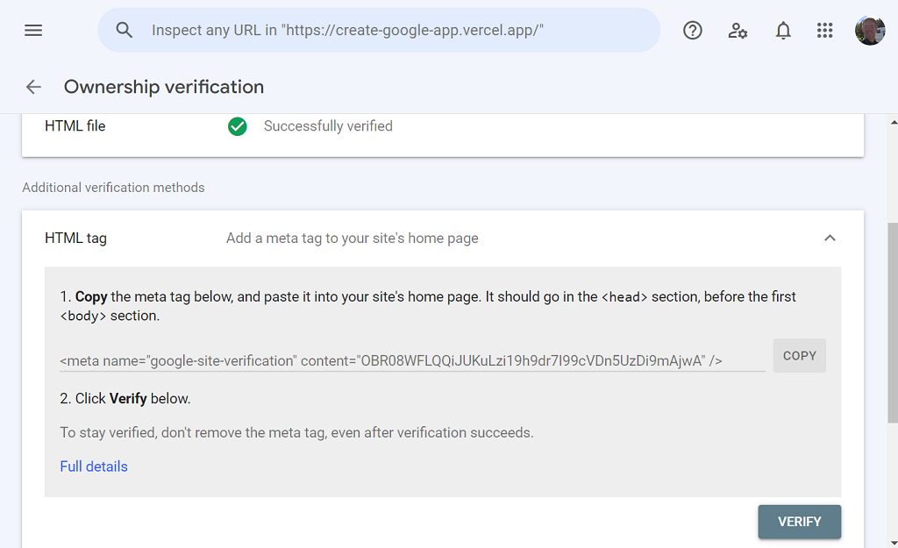

# Verification and Analytics
After the first publication on vercel, we have to verify our ownership of the domain. This is requried if we want google know about our website. It maybe not requried to publish the app (I'm not shoure yet). Then we also want to use Vercel Analytics for checking visitors.

## Google Search Console
The verification process can start when we add our site in Google Search Console.  

There are several ways to verify that we are the owner of the website.
1. Download from Search Console a html-file and put it in the public-directory.
2. Insert a code into the `.env`-file that we we get in the Search Console.

### About the main method
The google-file to put in public is a html-file, who name starts with "google*"

This is a easy method, and it's not necessary to use more methods to verify the ownership, but you can:

### About the alternative method
_Image: This is a capture of the verification screen in `Search Console`_
{.border-solid .border-4}

The problem with (one of) the alternative method, is that we normally put the string key in a `.env`-file. The _.env_file is normally added in the `.gitignore`-file. If that's the case - the _.env_-file will not follow to the vercel-deployment. The solution is to add the code trough the `settings` in our vercel-account, or (not recommended) to remove the line with the _.env_ in the _.gitignore_-file.

## Vercel Analytics
I have already prepared for use of Vercel Analytics. The only thin we need to do is to start the service on vercel.

<!-- 
Made by lovkyndig 2023.
-->