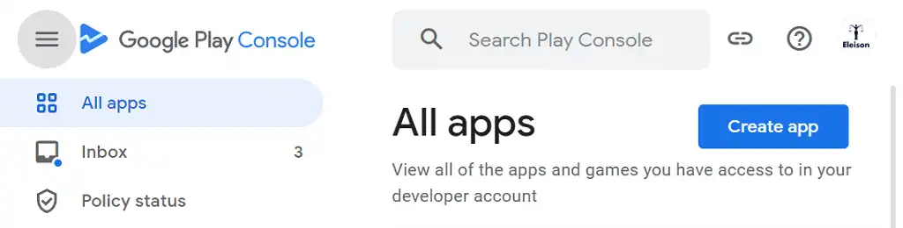

# Google Play Console
When we have created the app with bubblewrap, then we can go on to `Goole Play console`. You need an google account to get access to the Play Console. Be aware of that publishing apps isn't totally free. To get lifetime access, you have to pay 25 dollar. Then you can publish apps the rest of your life, without paying anything. It's everything or nothing.

## The Play Console
_Image: Here we se a minimal screen clip of the console:_
{.border-solid .border-4}

When you have deside a name of the app, its just to start adding the app. Google will try to guide you trough the prosess.

There is so many menus and it will take time to find out how to do it. I think there will be a lot easier for you if I told you the most important things.

## The ...

<!-- 
Made by lovkyndig 2023.
-->